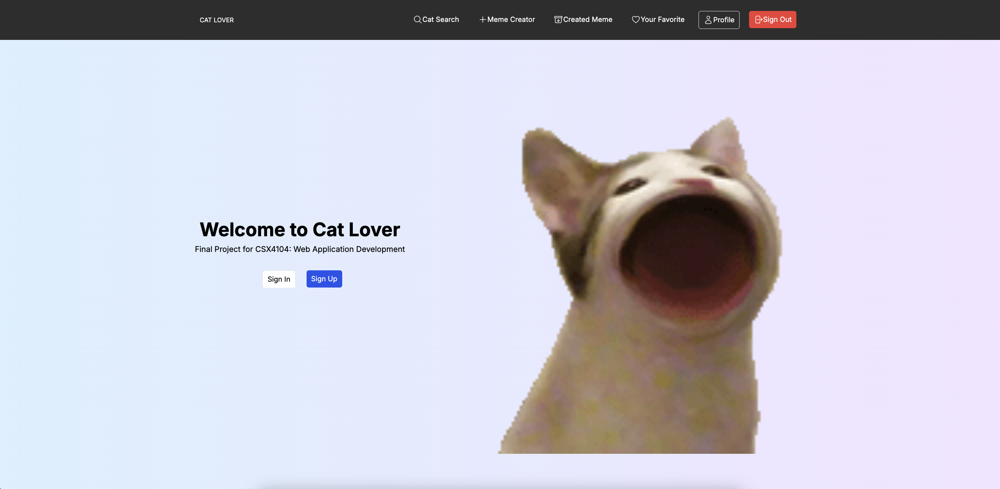
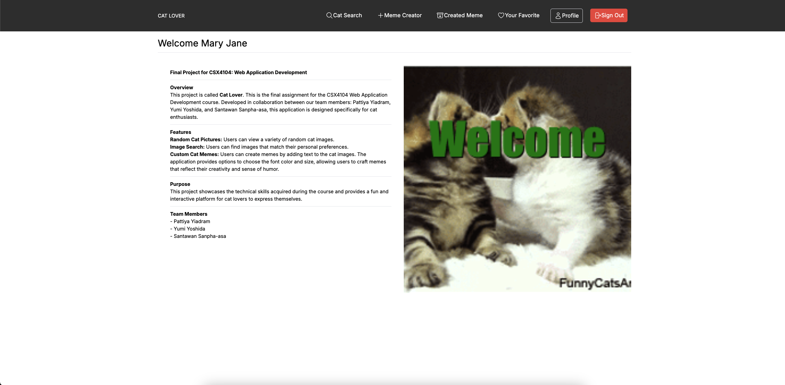
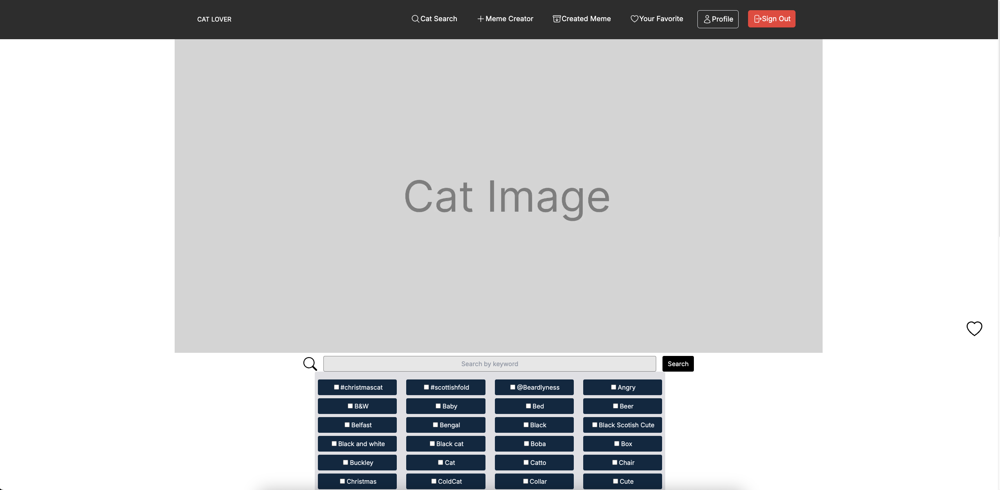
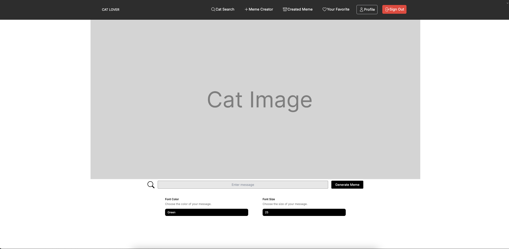
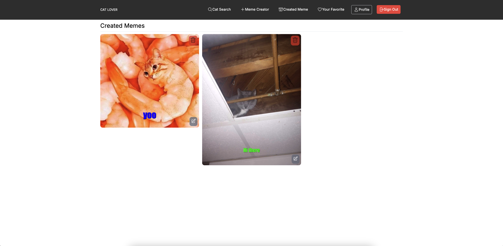
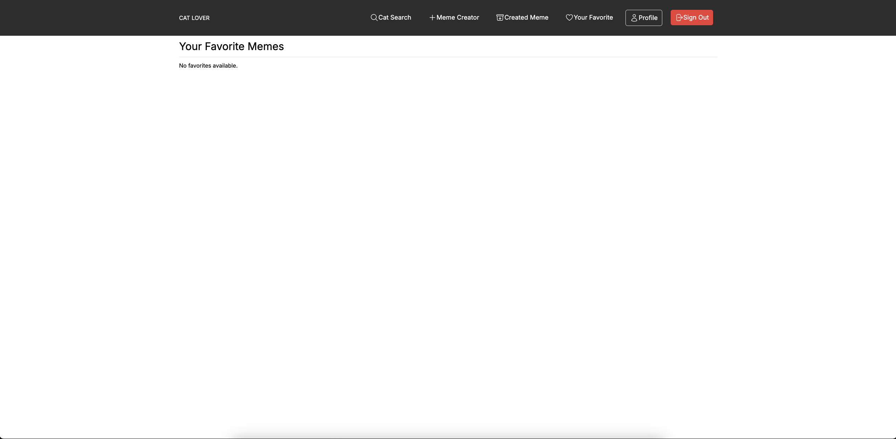
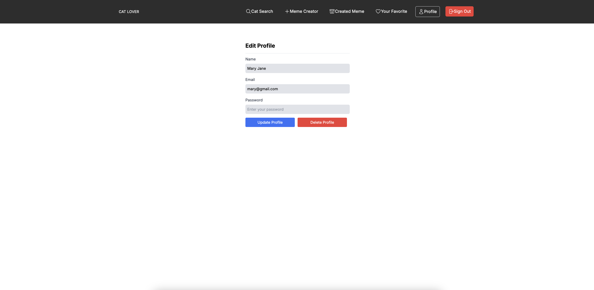

# Final Project for CSX4104: Web Application Development

## Overview

This project is called **Cat Lover**. This is the final assignment for the CSX4104 Web Application Development course. Developed in collaboration between our team members: Pattiya Yiadram, Yumi Yoshida, and Santawan Sanpha-asa, this application is designed specifically for cat enthusiasts.

## Features

- **Random Cat Pictures:** Users can view various random cat images.
- **Image Search:** Users can find images matching their preferences.
- **Custom Cat Memes:** Users can create memes by adding text to the cat images. The application provides options to choose the font color and size, allowing users to craft memes that reflect their creativity and sense of humor.

## Purpose

This project showcases the technical skills acquired during the course and provides a fun and interactive platform for cat lovers to express themselves.

## Team Members
- Pattiya Yiadram -> Repository: https://github.com/PattiyaY/cat-lover
- Yumi Yoshida -> Repository: https://github.com/PenginYY/cat-lover
- Santawan Sanpha-asa -> Repository: https://github.com/piobookz/cat-lover

## Screenshots
### Home page

###  Welcome page

### Cat Search page

### Meme Creator page

### Created Memes page

### Favorite Memes page

### Profile page

